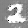

# DCGAN-MNIST
Use DCGAN to generate images of numbers, trained with MNIST.

## Code

You can see the code from `GAN.py`.

## Dataset

Data used in this project is from MNIST dataset.

## Sample Result

